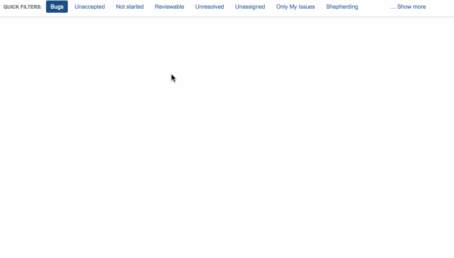

# Jira Quicker Filters

## Introduction

_Like the `QUICK FILTERS` toolbar in Jira, but with less general unquickness._

Switching between quick filtes in Jira can be tedious. Particularly when your
defined filters are mutually exclusive (issues assigned to particular users,
for example) requiring you to unselect the current filtler before selecting the
next.

This userscript aims to speed this process up by adding keyboard interactions
and a dialog to switch from one filter to the next.

## Usage

On any Rapid Board page in jira:

* Open dialog: <kbd>F</kbd>
* Close dialog: <kbd>Esc</kbd> (or select a filter)
* Navigate list: <kbd>Up</kbd>/<kbd>Down</kbd>
* Select a filter: <kbd>Enter</kbd>

You can also click on a filter to select it, type into the search field to
narrow down the list of available filters, or select the currently active filter
to clear it.

## Choppy gif action

